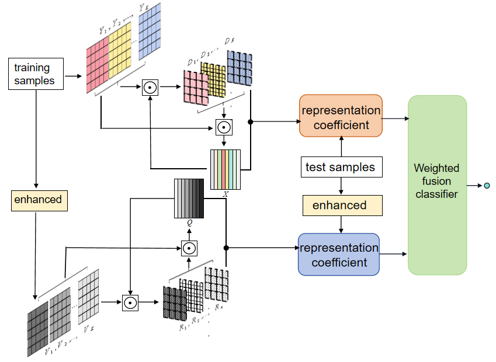

# Enhanced Multi-Feature Fusion Dictionary Learning for Robust Face Recognition
- This is the main model of the paper "Enhanced Multi-Feature Fusion Dictionary Learning for Robust Face Recognition" 




## 1. Environment

- Matlab2021b
- TDM-GCC
- ksvdbox
- OMPbox


## 2. Test

### 💓  For ORL  task
**1. Prepare dataset**: 

read_data_orl.m
read_datav_ORL.m

**2. Setup configurations**: 

```
    c=40
    train_num=5
    miu=127
    sigma=40
    dictsize=200 %dictsiae=train_num*c
```

**3. Run**: 

main.m


## 3. Contact
If you have any question about our work or code, please email `xiesyu_stu@126.com` .
